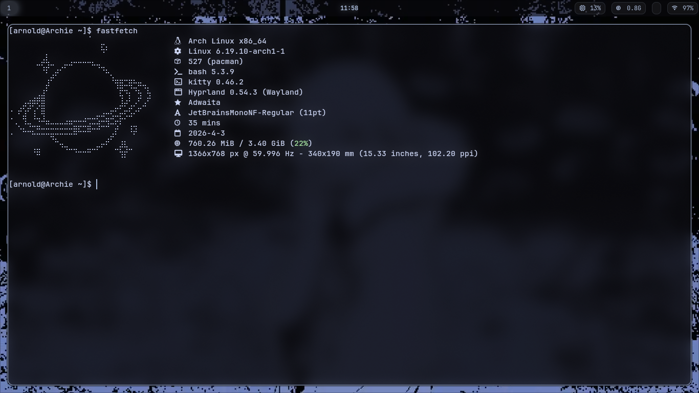
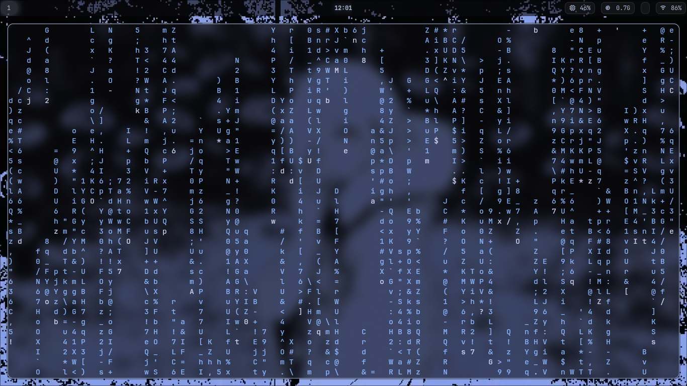
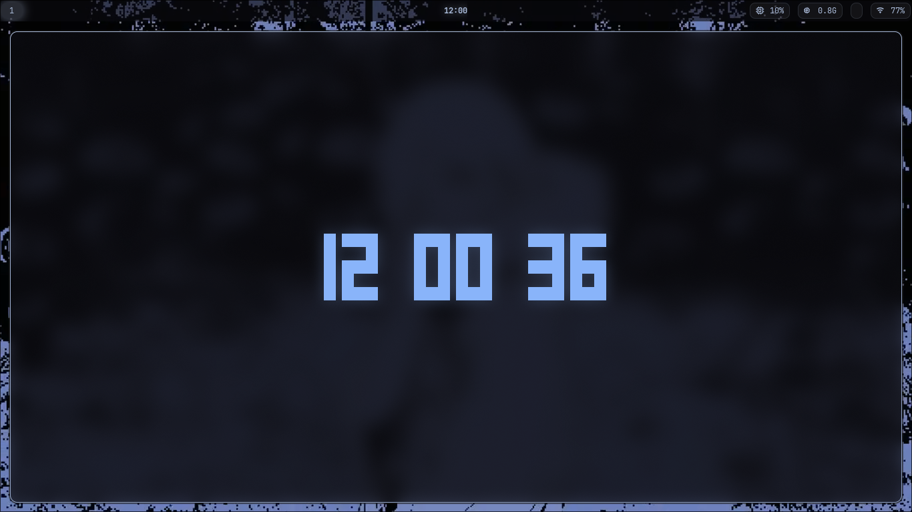

# 🌀 Arch-Rice

Minimal Hyprland rice with a clean blue aesthetic.

---

## 📸

<p align="center">
  
  
  
</p>

---

## ⚙️ Stack

* Hyprland (Wayland)
* Kitty
* Waybar
* Wofi
* Neovim
* Fastfetch
* btop
* mpv

---

## 📦 Install

```bash
git clone https://github.com/arnoxldq/Arch-Rice.git
cd Arch-Rice
cp -r * ~/.config/
```

---

## ⚠️ Notes

* Backup your configs before copying
* Arch + Wayland only

---

⭐ Star if you like it

